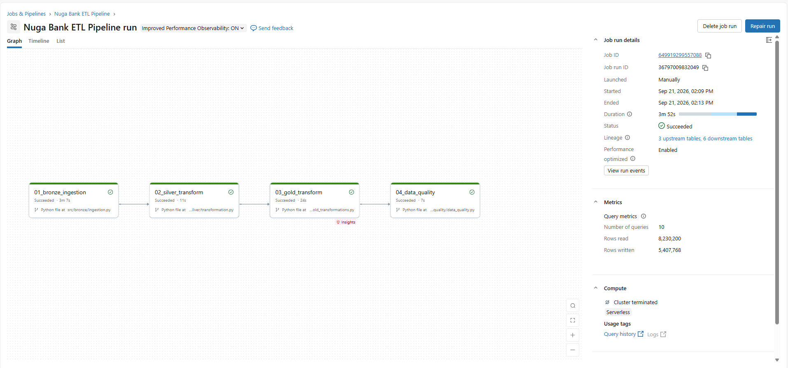

# Nuga Bank Data Engineering Pipeline

An end-to-end data engineering project built with Databricks and PySpark
to ingest, transform, model, and validate banking transaction data.

## Project Overview

This project implements a medallion architecture in Databricks for
processing Nuga Bank transaction data.

The pipeline takes raw CSV transaction data through Bronze, Silver,
and Gold layers before performing automated data quality validation.

## Architecture

Raw CSV
   |
   v
Bronze Layer
   |
   v
Silver Layer
   |
   v
Gold Layer
   |
   v
Data Quality Checks

### Bronze Layer

The Bronze layer ingests the raw transaction CSV from a Unity Catalog
Volume and stores the data as a Delta table.

### Silver Layer

The Silver layer performs data cleaning and standardization, including:

- Handling missing values
- Removing records with missing required values
- Correcting data types
- Preparing the dataset for downstream modelling

### Gold Layer

The Gold layer creates analytics-ready tables:

- Customer
- Employee
- Transaction
- Fact Table

These tables provide a structured model for downstream analytics and
reporting.

## Data Quality

The final workflow task performs automated validation of the Gold layer.

Current checks include:

- Fact table is not empty
- Customer IDs are not null
- Employee IDs are not null
- Transaction IDs are not null

The task raises an error if a validation check fails, causing the
Databricks Workflow to fail rather than silently accepting invalid data.

## Databricks Workflow

The pipeline is orchestrated using Databricks Jobs.

Execution order:

01_bronze_ingestion
        |
        v
02_silver_transform
        |
        v
03_gold_transform
        |
        v
04_data_quality

Each task runs only after its upstream dependency succeeds.

## Workflow Execution

The complete pipeline is orchestrated as a Databricks Job with
task dependencies between each processing layer.

## Technologies

- Databricks
- Apache Spark
- PySpark
- Delta Lake
- Unity Catalog
- Databricks Workflows
- Git
- GitHub

## Project Structure

nuga-bank-data-pipeline/
|
|-- setup_warehouse.py
|-- ingestion.py
|-- transformation.py
|-- gold_transformations.py
|-- data_quality.py
|
|-- notebooks/
|   `-- development_testing
|
`-- README.md

## Pipeline Results

The completed Databricks Workflow successfully executed all four
pipeline stages:

- Bronze ingestion
- Silver transformation
- Gold transformation
- Data quality validation

The workflow also provides execution metrics, lineage, task monitoring,
and failure visibility through Databricks.

## Future Improvements

Potential improvements include:

- Parameterizing catalog and source paths
- Incremental ingestion instead of full overwrite
- Additional data quality rules
- Automated testing
- Environment-specific configuration
- Scheduled ingestion when a recurring data source is available